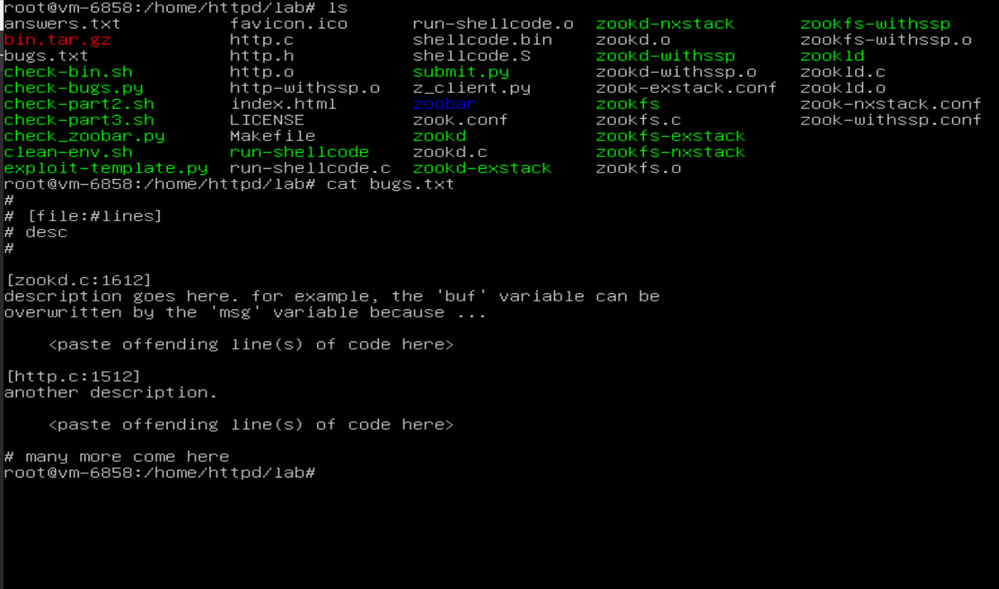

## 6.858 Fall 2014 Lab 1: Buffer overflows

**Lab 1:** You will explore the base structure of the zoobar web application and use buffer overflow attacks to break its security properties.

> MIT explicitly says Exercise 1 requires us to identify at least five buffer-overflow vulnerabilities, describe the vulnerable buffer, construct the HTTP
> input that reaches it, and determine whether stack canaries would stop it.
### Setup
Credentials:
login: httpd
password: 6858

---

+ Don't normally work as root. Use:
 ```bash  Use: su- httpd
    If necessary, work from
    cd /home/httpd/lab
```
+ The official MIT 2014 lab repository is :
```bash git clone git://g.csail.mit.edu/6.858-lab-2014 lab. ```

### Part 1: Finding buffer overflows
# Security Lab Notes: Initial Reconnaissance & State Analysis

##  Operational Environment & Rules of Engagement
*   **Current Session:** Logged in as `root`.
*   **Lab Practice:** For actual lab work, use the `httpd` account where possible. Keep `root` available strictly for controlled administrative tasks.
*   **Exploitation Phase:** **DO NOT** run `exploit-template.py` yet. We must first understand the target binary and source code.

##  Primary Research Question
> **What change in program state allows an attacker-controlled input to influence control flow?**

To answer this, we must move beyond simply identifying dangerous functions (e.g., `sprintf`, `strcpy`) and experimentally establish the exact mechanism of state transition:

$$ S_i \xrightarrow{x} S_{i+1} $$

*Where:*
*  $$\(S_i\)$$ = Initial program state
*  $$\(x\)$$ = Attacker-controlled input
*  $$\(S_{i+1}\)$$ = Subsequent program state (potentially compromised)

**Model type: discrete-state transition model.**

---

### Step 1 - look at the required bugs.txt format

Currently in the root. Run:
```Bash
cd /home/httpd/lab
cat bugs.txt

```


### Step 2 - find the dangerous operations

Then run:
```Bash
grep -nE 'strcpy|strcat|sprintf|vsprintf|gets|memcpy|memmove|scanf|sscanf|url_decode' \
    http.c zookd.c zookfs.c
```
also:

```Bash
grep -nE 'char .*\\[[0-9]+' http.c zookd.c zookfs.c

```
+ This gives us our candidate vulnerability set.

### Step 3 - inspect the request-processing path

The important path is roughly:  

```Bash
HTTP request
     ↓
zookd
     ↓
http_request_line()
     ↓
http_request_headers()
     ↓
http_serve()
     ↓
zookfs / other handler

```
> MIT's architecture confirms that zookd receives the HTTP request and dispatches it to the appropriate service.
> We're going to trace attacker-controlled data through that path.


