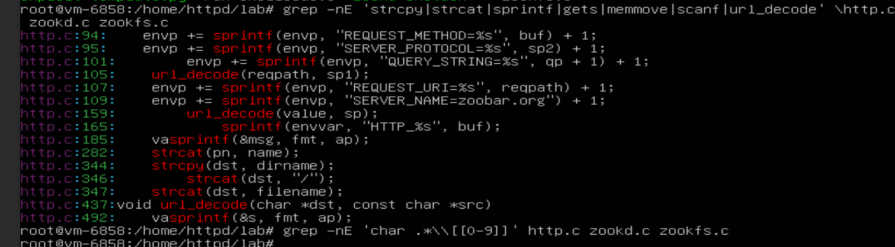

## 6.858 Fall 2014 Lab 1: Buffer overflows

**Lab 1:** You will explore the base structure of the zoobar web application and use buffer overflow attacks to break its security properties.

> MIT explicitly says Exercise 1 requires us to identify at least five buffer-overflow vulnerabilities, describe the vulnerable buffer, construct the HTTP
> input that reaches it, and determine whether stack canaries would stop it.
### Setup
Credentials:
login: httpd
password: 6858

---

+ Don't normally work as root. Use:
 ```bash  Use: su- httpd
    If necessary, work from
    cd /home/httpd/lab
```
+ The official MIT 2014 lab repository is :
```bash git clone git://g.csail.mit.edu/6.858-lab-2014 lab. ```

### Part 1: Finding buffer overflows
# Security Lab Notes: Initial Reconnaissance & State Analysis

##  Operational Environment & Rules of Engagement
*   **Current Session:** Logged in as `root`.
*   **Lab Practice:** For actual lab work, use the `httpd` account where possible. Keep `root` available strictly for controlled administrative tasks.
*   **Exploitation Phase:** **DO NOT** run `exploit-template.py` yet. We must first understand the target binary and source code.

##  Primary Research Question
> **What change in program state allows an attacker-controlled input to influence control flow?**

To answer this, we must move beyond simply identifying dangerous functions (e.g., `sprintf`, `strcpy`) and experimentally establish the exact mechanism of state transition:

$$ S_i \xrightarrow{x} S_{i+1} $$

*Where:*
*  $$\(S_i\)$$ = Initial program state
*  $$\(x\)$$ = Attacker-controlled input
*  $$\(S_{i+1}\)$$ = Subsequent program state (potentially compromised)

**Model type: discrete-state transition model.**

---

### Step 1 - look at the required bugs.txt format

Currently in the root. Run:
```Bash
cd /home/httpd/lab
cat bugs.txt

```


### Step 2 - find the dangerous operations

Then run:
```Bash
grep -nE 'strcpy|strcat|sprintf|vsprintf|gets|memcpy|memmove|scanf|sscanf|url_decode' \
    http.c zookd.c zookfs.c
```
also:

```Bash
grep -nE 'char .*\\[[0-9]+' http.c zookd.c zookfs.c

```
+ This gives us our candidate vulnerability set.

  

  # Security Lab Analysis: Vulnerable Functions & Attack Vectors

Here is an analysis of the findings and what they likely mean for the lab.

## 1. The Vulnerable Functions Identified
The initial `grep` command highlights the specific lines where dangerous C functions are used. These are the "red flags" for memory corruption vulnerabilities:

*   **`sprintf` (Lines 94, 95, 101, 107, 109, 165):** This is the most critical finding. `sprintf` writes formatted data to a string buffer **without checking the size of the destination buffer**. If the input data is larger than the buffer, it will overwrite adjacent memory on the stack (Stack Buffer Overflow).
*   **`strcpy` (Line 344):** Similar to `sprintf`, `strcpy` copies a string until a null terminator is found without checking the destination buffer size.
*   **`strcat` (Lines 282, 346, 347):** Appends a string to the end of another. If the destination buffer isn't large enough to hold the combined strings, it causes an overflow.
*   **`vaspringf` / `vsprintf` (Lines 185, 492):** These are variadic versions of `sprintf`. They are equally dangerous if the format string or the arguments are user-controlled and not length-checked.

## 2. The "Sink" (Where the bug probably lives)
While all the functions listed are dangerous, the context points strongly to `http.c`:

### Line 165: `sprintf(envvar, "HTTP_%s", buf);`
*   **Analysis:** This line takes a buffer `buf` (likely containing an HTTP header name or value from a request) and formats it into a variable called `envvar`.
*   **The Bug:** If `envvar` is a fixed-size stack buffer (e.g., `char envvar[128];`) and `buf` is attacker-controlled and large, you can overflow `envvar`.

### Line 185: `vasprintf` (and Lines 94/95/101/107)
*   These appear to be constructing the environment for a CGI script.
*   If the HTTP request allows you to set arbitrary headers or long query strings, lines 94-109 are prime targets for overflowing the `envp` buffers.

## 3. The `url_decode` Function (Line 437)
You identified the `url_decode` function definition on line 437.

*   **Why this matters:** `url_decode` usually takes an encoded input (like `%41` for 'A') and converts it to raw bytes.
*   **The Risk:** If `url_decode` does not perform bounds checking on the destination buffer `dst`, it is a **direct vector** for the overflow. Even if `sprintf` checks sizes (which it usually doesn't), `url_decode` might blindly write data. You should inspect how `url_decode` is implemented (does it check the length of `dst`?).

## 4. The Second Grep Command (No Output)
Your second command was:
```bash
grep -nE 'char .*\[[0-9]' http.c zookd.c zookfs.c
```

**Result:** It returned nothing (or was cut off).

**Meaning:** This is actually very interesting. It means the source code does **not** define fixed-size character arrays using a literal integer (e.g., `char buffer[512];`).

**Possibilities:**
*   The buffers are defined using a `#define` macro (e.g., `char buffer[MAX_LINE];`).
*   The buffers are dynamically allocated using `malloc` (Heap Overflow instead of Stack Overflow).
*   The syntax might be slightly different (e.g., spaces: `char * buffer`).

## Next Steps for Your Lab
To exploit this (or fix it), you need to find out where the buffers are defined and how big they are.

### 1. Find the buffer definitions
Run this command to find the variable declarations:
```bash
grep -nE "char|uint8_t|u_char" http.c | grep -E "\*|\["
```
Look for the variables `envvar`, `buf`, `envp`, `dst`, `sp`, and `sp1`. Where are they declared? Are they `malloc`'d or on the stack?

### 2. Check `url_decode` logic (Line 437)
Open the file around line 437:
```bash
sed -n '437,480p' http.c
```
Look at the loop. Does it check if `dst` is full before writing? If not, that's your vulnerability.

### 3. Trace `buf` on Line 165
Find out where `buf` comes from. Is it user input? If you can send a massive HTTP header, you can overflow `envvar` at line 165.

---
**Summary:** You are on the right track. The heavy use of `sprintf` and `strcat` in `http.c` combined with a likely unchecked `url_decode` function suggests this web server is vulnerable to a remote buffer overflow via HTTP headers or URL parameters.

### Step 3 - inspect the request-processing path

The important path is roughly:  

```Bash
HTTP request
     ↓
zookd
     ↓
http_request_line()
     ↓
http_request_headers()
     ↓
http_serve()
     ↓
zookfs / other handler

```
> MIT's architecture confirms that zookd receives the HTTP request and dispatches it to the appropriate service.
> We're going to trace attacker-controlled data through that path.
>
# PhD-Level Vulnerability Analysis Framework

Here is the PhD-level way I want us to analyze each bug.

For each candidate, we'll create this structure:

---

## Vulnerability \(V_i\)

### 1. Location
```text
file: http.c
function: ______
line: ______
```

### 2. Vulnerable object
*Example:*
```text
buffer B
capacity C = 512 bytes
```

### 3. Attacker-controlled input

$$ x \in X $$

where \(X\) is the set of possible HTTP inputs.

### 4. Overflow condition

The basic condition is:

$$ |x| > C $$

or, more accurately, when there is existing content in the buffer:

$$ |existing| + |x| + 1 > C $$

**Model type:** Buffer-capacity / memory-safety condition.

### 5. State transition

We then describe:

$$ S_i \xrightarrow{x} S_{i+1} $$

**Model type:** Discrete-state transition model.

If the overflow changes a return address:

$$ PC_{return} \neq PC_{legitimate} $$

we have a **control-flow integrity violation**.

### 6. HTTP construction

We won't just say:

> "Send a long URL."

We'll identify exactly where the data enters:

```http
GET /<attacker-controlled-data> HTTP/1.0
```

or:

```http
Header-Name: <attacker-controlled-data>
```

or:

```http
GET /path?<attacker-controlled-data> HTTP/1.0
```

### 7. Stack-canary analysis

We ask:

> Does the corrupted object lie in a stack frame such that overwriting it also overwrites the compiler's stack canary before the function returns?

If yes:

*   Likely canary-protected.

If the overflow instead corrupts something that is used before the function returns, such as a function pointer:

*   Potentially not prevented by a conventional stack canary.

That distinction is extremely important. MIT specifically asks you to reason about whether each vulnerability can be prevented by stack canaries.

---
# Vulnerability Analysis Notes

## Analyzing MIT's `bugs.txt` Requirements

Now we know exactly what MIT expects in `bugs.txt`. The screenshot shows the template:

```
[file:#lines]
desc

```

The `zookd.c:1612` and `http.c:1512` entries are only examples/placeholders. We need to replace them with real vulnerabilities from the source.

This is where we'll do the deeper analysis.

---

### Step 1 — Find the Candidate Dangerous Functions

From `/home/httpd/lab`, run:

```bash
grep -nE 'strcpy|strcat|sprintf|vsprintf|gets|memcpy|memmove|scanf|sscanf' \
    *.c
```

Then also:

```bash
grep -nE 'char[[:space:]]+[A-Za-z_][A-Za-z0-9_]*\[[0-9]+' \
    *.c
```

---

### What We're Looking For

For example, if we find:

```c
char buf[128];
strcpy(buf, input);
```

we don't immediately declare "Bug!"

We ask:

> **Is** `|input| > 128` **possible?**

If yes, we have a candidate.

**Mathematical model type:** Buffer-capacity model

|input| > C


where `C` is the capacity of the destination buffer.

Then we determine how the attacker controls `input`.

---

### Data-Flow Model


where `C` is the capacity of the destination buffer.

Then we determine how the attacker controls `input`.

---

### Data-Flow Model

```c
HTTP request
↓
URL / header / body
↓
server parsing
↓
input
↓
strcpy()
↓
buffer overflow
```


That's our data-flow model.

Then we ask whether a stack canary would intervene.

> One thing I don't want you to do :))


